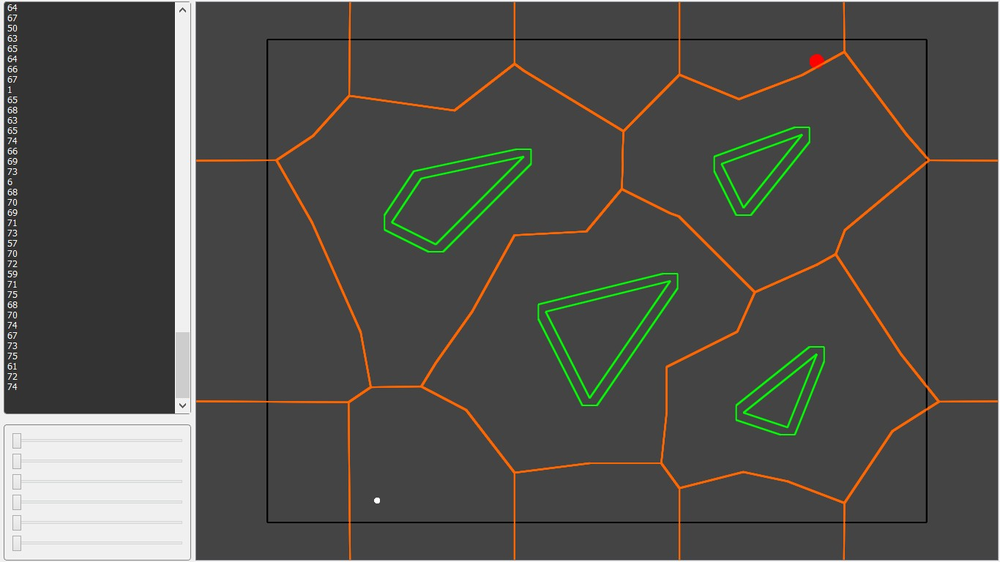
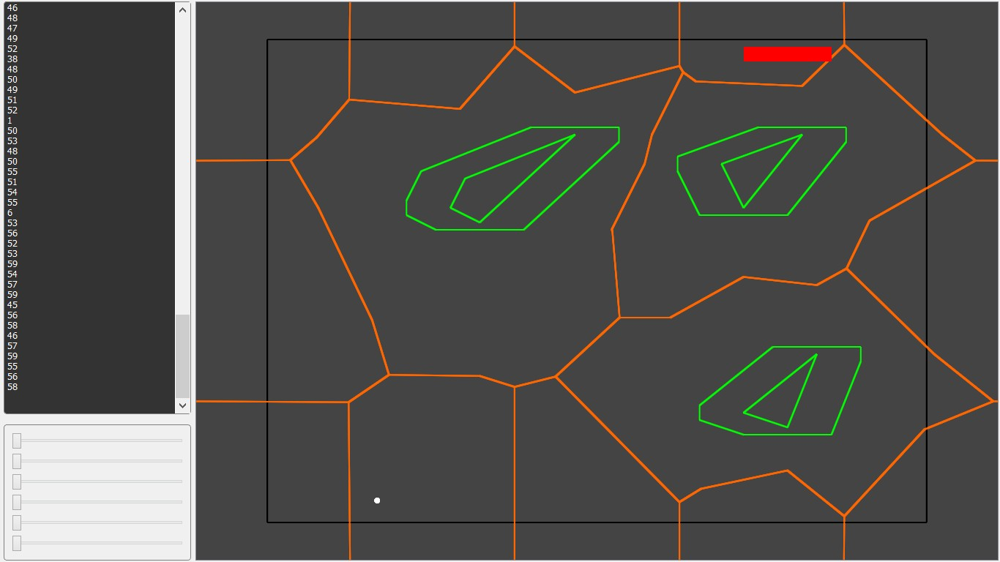
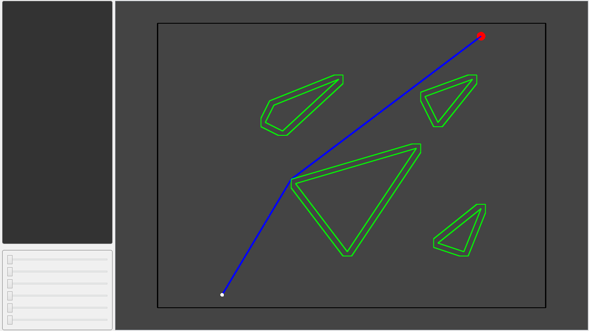
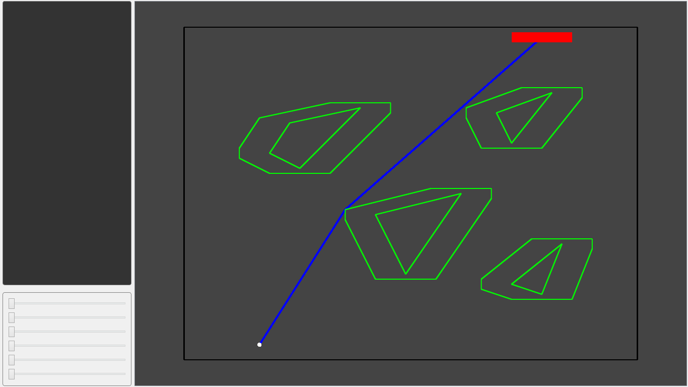
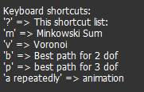

# Robot motion planning

We developed a path planner for a circular robot( 2degrees of freedom). To
achieve this, we initially found the Minkowski sum of both the robot and the
obstacles, designing the configuration space C.

## Modeling the environment

To calculate the Minkowski sum, we move the robot to the point with coordinates
(0,0), invert it and then add the coordinates of all obstacles’ corners with
each point of the robot. Of course, we have previously discretized our circular
robot.

So finally, we have n + m points from which we find their convex hull ,which
give us the obstacle in the C space. We repeat the process for all the obstacles
in our space, checking if some obstacles intersect(so we find their union).

After we find all the Minkowski sums we calculate the Delauny triangulation for
all obstacles’ peaks including the points defining the outer shell.

We do this with an additive algorithm, which adds all the points one by one.
Then based on the duality property, we get the Voronoi diagram for each triangle

and we connect it with the barycenter of all adjacent triangles. The only thing
left to get the final Voronoi diagram is to delete all those lines that
intersect the obstacles

## 3 degrees of freedom Robot

In the next step, where we use a robot with three degrees of freedom, there are
not many

important changes in calculating Minkowski sums. Once again, we add all the
points of -Robot (0,0) with all the points of the obstacle and find their convex
hull. The only difference is that the robot is rotated by φ. Similarly, for
calculating it the Voronoi diagram we follow the same procedure as before. We
calculate for each rotation angle of the robot the Delauny triangulation then
the Voronoi diagram.

## Find optimal path

In order to find the optimum path to move the robot from one point to
another, we use the Visibility graph method. However, because finding the entire
graph has big time and memory complexity, we use a variation by finding all the
visible tops from one point. More analytically in the case of the robot with 2
degrees of freedom, we find only the visible peaks from the position of the
robot and we move to that which improves our position in the best possible way.
This is essentially a local

search / best - first search. Then we repeat the process until we reach our
final destination. Obviously, because we do not find the whole graph, it is
likely that the path that will be found will not always be optimal, but most
times this is not the case .

On the other hand, in the case of a robot with three degrees of freedom the
search is different. First, we check if there is a rotation angle at which the
robot can reach the destination without turning it further. If it does not exist
we follow this procedure:

We start again from the beginning and find the visible peaks, ie the visibility
graph from that point. Then we move to the optimal peak if and only if the next
move from this peak improves our position. In other words, we check if it moves
to a dead-end. If the next move does not improve the position, we are not moving
but we rotate the robot and

repeat until there is a valid move. From the new position ,we repeat the process
until we reach the target point.

Notes

-   The coordinates of the obstacles as well as the position / orientation of
    the robot are loaded from a txt file (coordinates.txt). The txt has the
    following format:

    -   Robot type (0 for circular, 1 for rod-shaped one-dimensional, 2 for
        2-dimensional)

    -   Several obstacles

    -   Number of 1st obstacle peaks

    -   1st Obstacle Peak Coordinates

    -   Number of 2nd obstacle peaks

    -   2nd obstacle coordinates

    -   Etc

-   To use the library, use the following shortcuts

